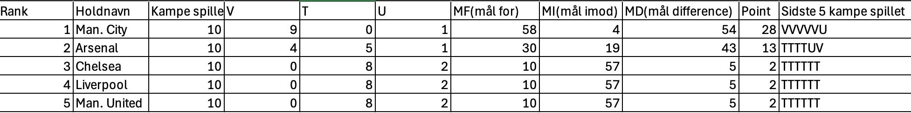
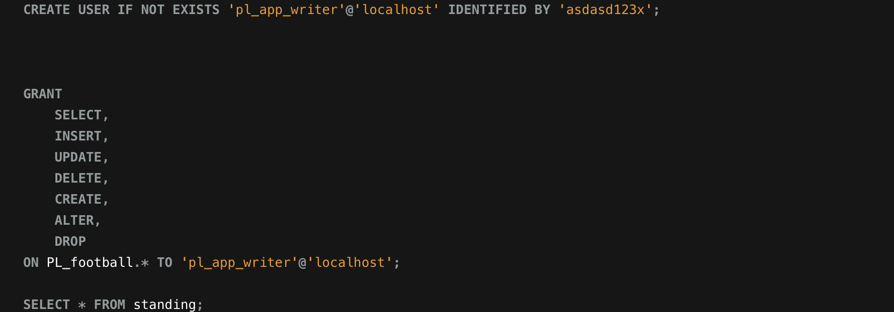
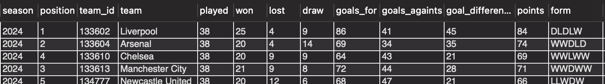

# Premier League 2024-2025

## Litteraturliste 

# Problemformulering

En sports cafe oplever overbelastnign med deres wifi under Premier League tuneringen udspiller sig. Når kampen slutter skynder alle kunder sig samtidigt med at tjekke rangerigen. dette forudagder at: 

- Internettet bliver langsomt for alle
- Kunderne bliver frustreret over ikke at få noget service
- Tab i omsætningen, da kunder vælger at tager over til andre cafeer

# Løsning 

løsning til problemet er et automatiseret leaderboard, som løbende opdateres:

- Et display ved siden af den store skærm
- Mindre tabletter rundt omkring cafeén, kan monteres ved borderne og skrænten

# Hvad vil fans se

Ny opdateret leaderboard af top 5 hold i Premier League turneringen 

- Hold navn, og Stilling
- Kampe spillet
- Vundet (V), Tabte (T), Uafgjort (U)
- Point (P)

  # Mockup

# Data pipeline struktur

  REST API → Python (Data Extraction) → Pandas (Transformation) → MySQL (Storage) → Frontend Display

  Jeg har undværet UI, men det kunne være en fin videreudvikling på opgaven

# Resultat

## SQL database

  ## Python 

